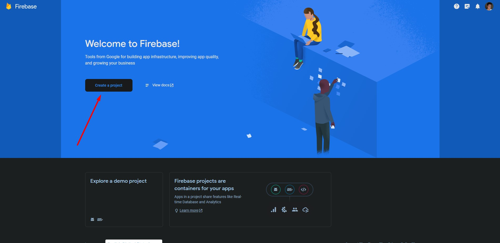
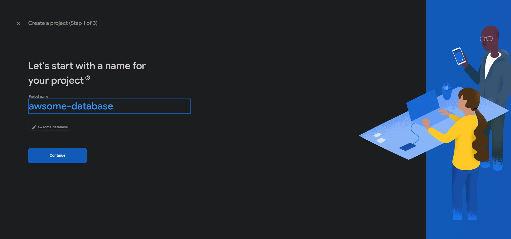
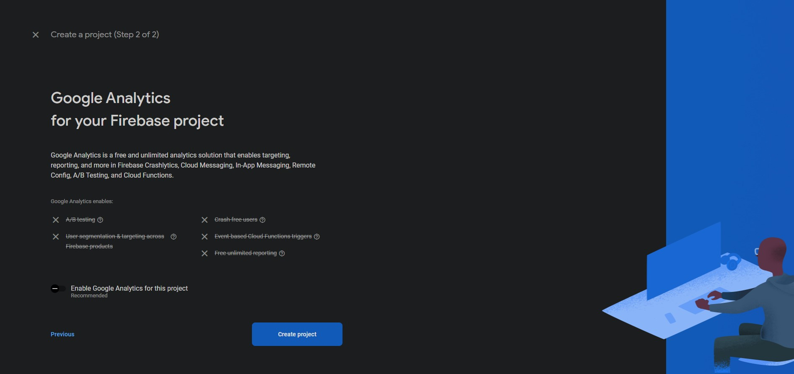
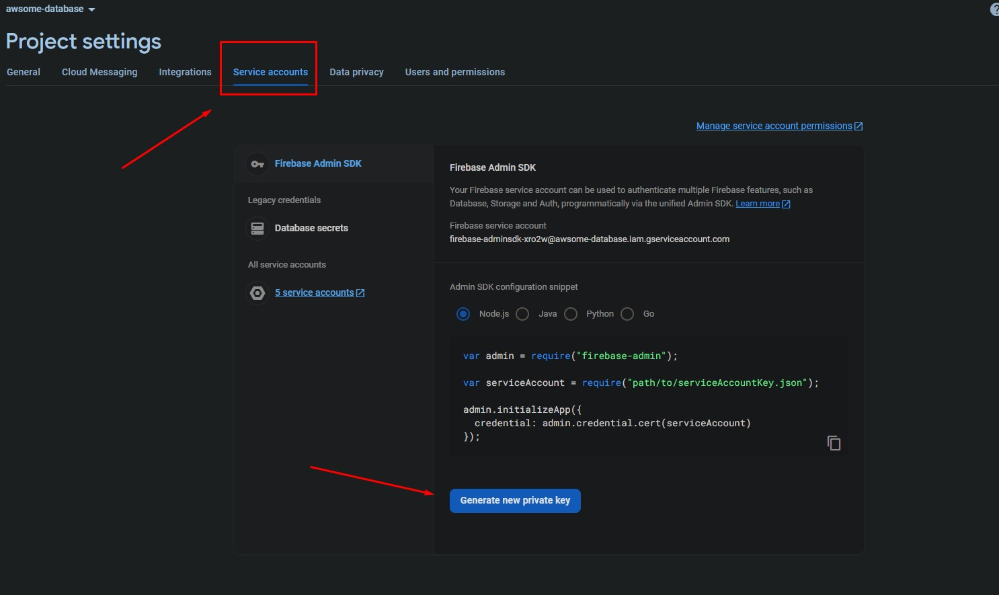
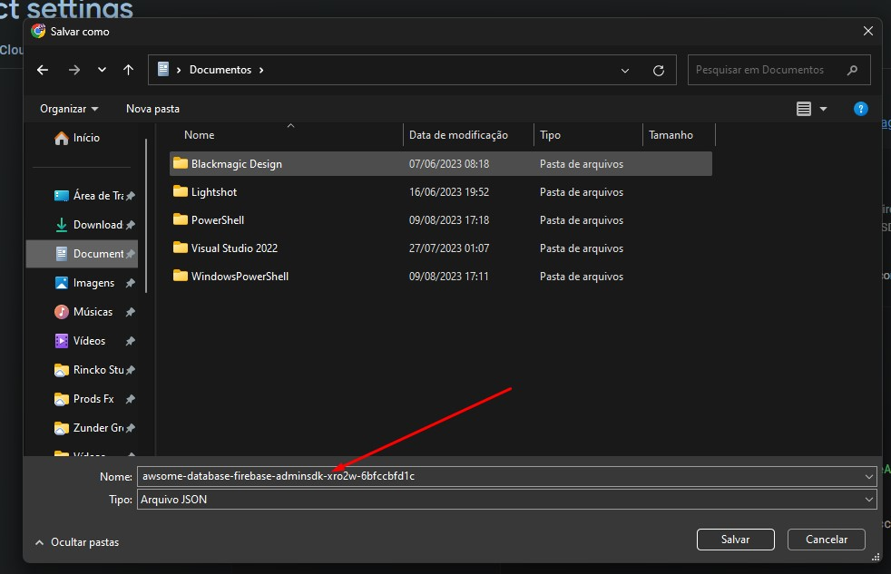

# Guide

- [English](#creating-a-firestore-database)
- [Português](#criando-um-banco-de-dados-firestore)

###  English
# Creating a Firestore Database
You need to have a Firebase account!

If you don't have one, please go to https://console.firebase.google.com/ and log in with your Google account.

Let's create a project

Give your project a name and continue

Leave this option unchecked if you prefer

Now click on Firestore Database in the sidebar

Create a new database

Leave "production mode" checked and click next

Choose the location of your database (recommended to be closer to your application's location)

Now you have a Firestore database

Access the project settings

Go to service accounts and click on generate new private key

You will be able to save this file on your computer

Rename the file to "firebase.json"

Save it in the root of your project

You're ready to use it!

<small> <a href="#guide">Home</a> </small>

###  Português
## Criando um banco de dados firestore

Você precisa ter uma conta firebase!

Caso não tenha acesse https://console.firebase.google.com/ e faça login com uma conta google.

Vamos criar um projeto

De um nome para o seu projeto e continue

Deixe essa opção desmarcada se preferir

Agora clique em Firestore Database na barra lateral

Crie um nova database

Deixe "production mode" marcado e clique em próximo

Escolha a localização do seu banco de dados (recomendado mais próximo da localização sua aplicação)

Agora você tem um banco de dados firestore

Acesse as configurações do projeto

Vá até contas de serviço e clique em gerar nova chave privada

Você vai poder salvar esse arquivo no seu computador

Renomeie o arquivo para "firebase.json"

Salve na raiz do seu projeto

Está pronto para usar!

<small> <a href="#guide">Início</a> </small>
