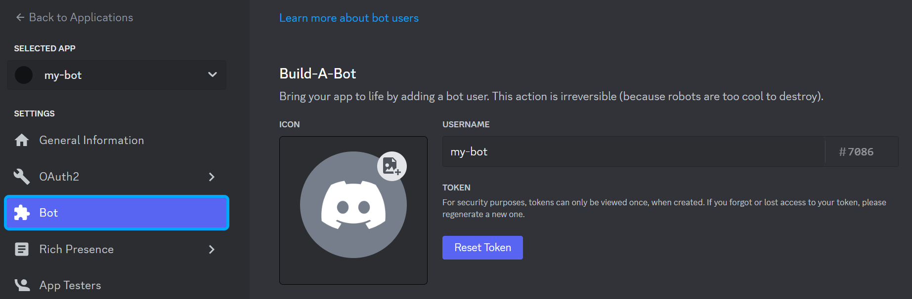

# Guide

- [English](#setup-your-application)
- [Português](#configure-seu-aplicativo)

###  English
## Setup your application

You need to take is setting up an actual Discord bot application via Discord's website.

First go to https://discord.com/developers/applications

Create a new application

Define the application name and create

Enable intents

Your bot's token will be revealed when you press the "Reset Token" button and confirm.

Copy the token and paste it in the .env file

To invite the bot to the server, click on the OAuth2 tab and then on URL Generator.
Check the "bot" and "application.commands" scopes. Check the admin permission. A url will be generated below, just access it to be able to choose the server you want the bot to join

<small> <a href="#guide">Home</a> </small>

###  Português
## Configure seu aplicativo

Você precisa configurar um aplicativo de bot do Discord por meio do site do Discord.

Primeiro acesse https://discord.com/developers/applications

Crie uma nova aplicação

Defina o nome da aplicação e clique em criar

Ativar os intents

O token do seu bot será revelado quando você pressionar o botão "Reset Token" e confirmar.

Copie o token e cole-o no arquivo .env

Para convidar o bot para o servidor, clique na aba OAuth2 e depois em URL Generator.
Marque os escopos "bot" e "application.commands". Marque a permissão de administrador. Uma url será gerada abaixo, basta acessá-la para poder escolher o servidor que deseja que o bot entre.

<small> <a href="#guide">Voltar ao início</a> </small>
