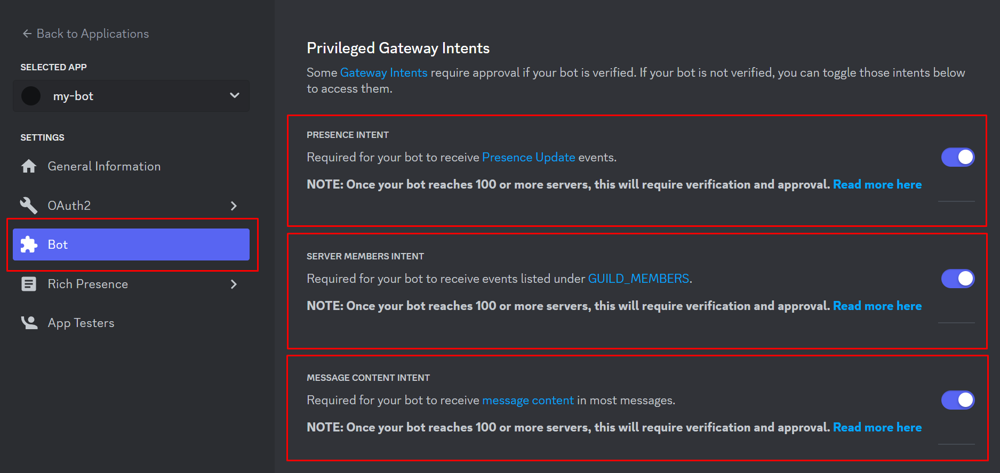

# Setup your application

You need to take is setting up an actual Discord bot application via Discord's website.

First go to https://discord.com/developers/applications

Create a new application

Define the application name and create

Enable intents

Your bot's token will be revealed when you press the "Reset Token" button and confirm.

Copy the token and paste it in the .env file